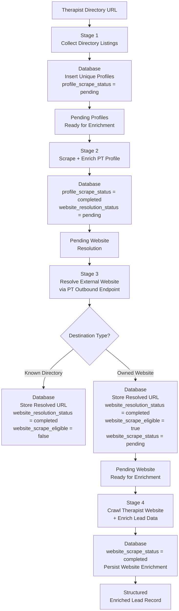

# Therapist Lead Intelligence & Data Enrichment Pipeline

A PostgreSQL-backed, multi-stage data enrichment pipeline that turns therapist-directory listings into **structured, enriched lead data** using concurrent workers, proxy leasing, resumable processing, and bandwidth-aware HTTP crawling.

**Python 3.12 · PostgreSQL · SQLAlchemy · asyncio · Curl CFFI · BeautifulSoup · Pydantic · Docker**

## Overview 

The pipeline starts with a therapist-directory listing, such as a Psychology Today search URL, and progressively converts directory profiles into structured therapist and practice data that can be used for lead generation.

Given:

- a directory URL
- a maximum number of profiles
- a maximum number of listing pages
- a configured proxy pool

the application processes each therapist through four independent stages:
1. **Directory Discovery** - collect therapist profile URLs.
2. **Profile Enrichment** - extract structured data from each directory profile.
3. **Website Resolution** - resolve external therapist website URLs from the directories without browser automation.
4. **Website Enrichment** - Crawl therapist-owned websites, extract additional information like emails, and categorize them into either private or group practices.

Each stage persists its output to PostgreSQL and only queues the next stage after successful completion. This allows stages to run independently without requiring the entire pipeline to run in one process.

# Architecture

