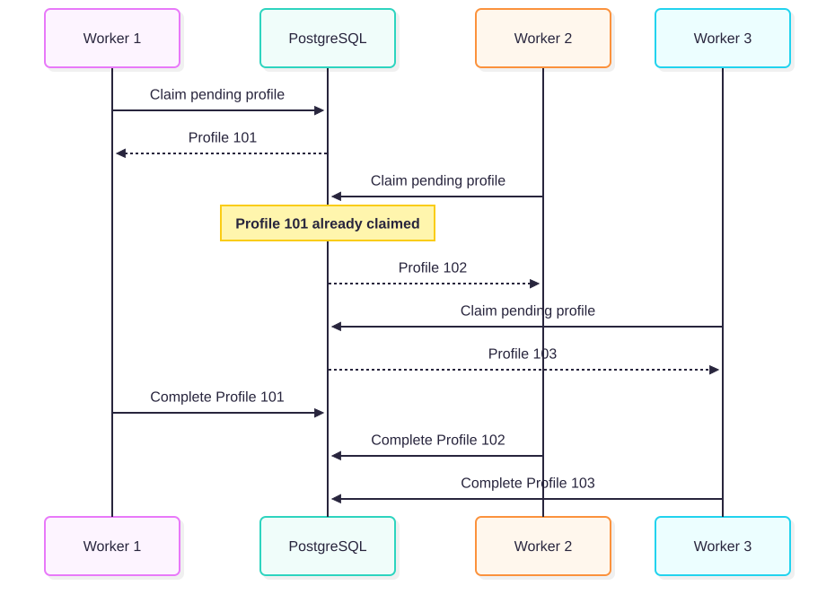
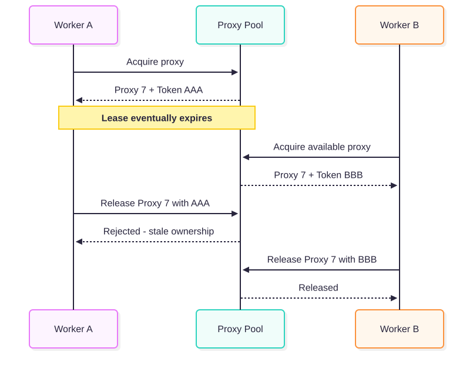

# Therapist Lead Intelligence & Data Enrichment Pipeline

A PostgreSQL-backed, multi-stage data enrichment pipeline that turns therapist-directory listings into **structured, enriched lead data** using concurrent workers, proxy leasing, resumable processing, and bandwidth-aware HTTP crawling.

**Python 3.12 · PostgreSQL · SQLAlchemy · asyncio · Curl CFFI · BeautifulSoup · Pydantic · Docker**

## Overview 

The pipeline starts with a therapist-directory listing, such as a Psychology Today search URL, and progressively converts directory profiles into structured therapist and practice data that can be used for lead generation.

Given:

- a directory URL
- a maximum number of profiles
- a maximum number of listing pages
- a configured proxy pool

the application processes each therapist through four independent stages:
1. **Directory Discovery** - collect therapist profile URLs.
2. **Profile Enrichment** - extract structured data from each directory profile.
3. **Website Resolution** - resolve external therapist website URLs from the directories without browser automation.
4. **Website Enrichment** - Crawl therapist-owned websites, extract additional information like emails, and categorize them into either private or group practices.


Each stage persists its output to PostgreSQL and only queues the next stage after successful completion. This allows stages to run independently without requiring the entire pipeline to run in one process.


# Architecture

<p align="center">
  
</p>

PostgreSQL is used for more than final storage.

It also provides:

- persistent pipeline state
- Workers claiming unique rows concurrently
- retry state
- attempt counters
- proxy ownership
- resumability
- communication between independent stages

The four processing stages are seperated:

```text
Stage 1 does not need Stage 2 to be running. 
Stage 2 does not need Stage 3 to be running.
Stage 3 does not need Stage 4 to be running.
```

Each stage creates persistent work that can be consumed later. 

---

# Engineering Highlights

## PostgreSQL-backed Concurrent Workers

Stages that process individual profiles i.e **profile_url, Website_resolution or Website scraping** use PostgreSQL itself as the work coordinator.

Workers claim pending rows using:

```sql SELECT ... FOR UPDATE SKIP LOCKED; ```

The worker changes the processing state while holding the database lock and then commits immediately. Another worker attempting to claim work skips the already-claimed row and moves to another pending profile.

<p align="center">
  <a href="docs/concurrent-workers.svg">
    
  </a>
</p>

<p align="center">
  <sub>Concurrent workers claim independent pending rows through PostgreSQL.</sub>
</p>

**database row locks are not held while HTTP requests are running**.

```text
BEGIN
↓
SELECT ... FOR UPDATE SKIP LOCKED
↓
processing = true
attempts += 1
↓
COMMIT
↓
HTTP processing happens outside the transaction
```
---

## Time-bounded Proxy Leasing

Proxies are not represented using only:

```text
is_in_use = true / false
```

Instead, a proxy acquisition creates a time-bounded ownership lease containing:

``text 
proxy 
lease_token
lease_until 
times_used
```
Release and renewal functions must provide the existing lease token for a specific proxy.

This prevents stale workers from modifying a proxy that has already expired and been assigned to another worker.


<p align="center">
  <a href="docs/proxy-leasing.svg">
    
  </a>
</p>

<p align="center">
  <sub>Proxy leases use ownership tokens so stale workers cannot release proxies that have already been reassigned.</sub>
</p>