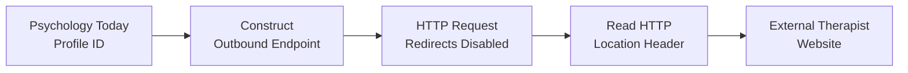
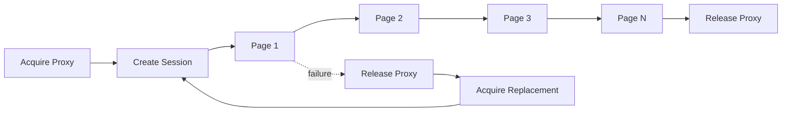
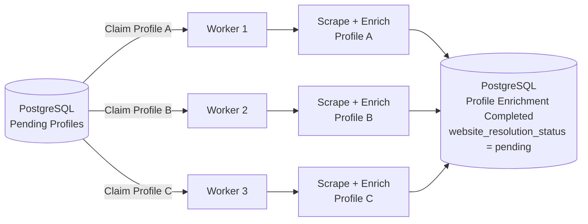
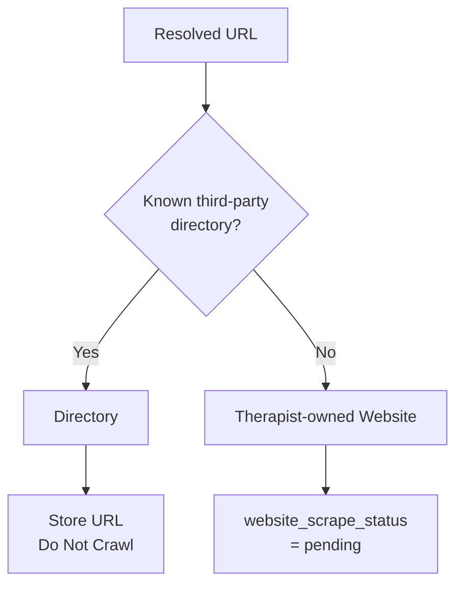
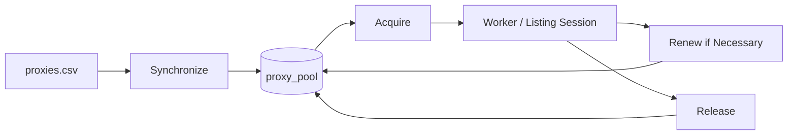
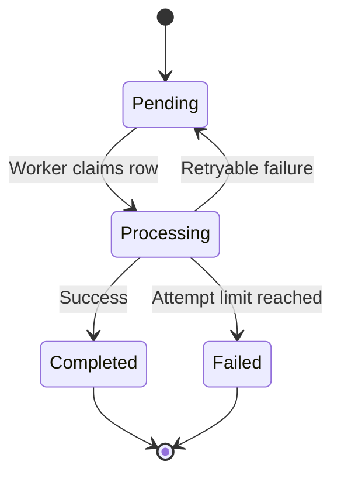

# Therapist Lead Intelligence & Data Enrichment Pipeline

A PostgreSQL-backed, multi-stage data enrichment pipeline that turns therapist-directory listings into **structured, enriched lead data** using concurrent workers, proxy leasing, resumable processing, and bandwidth-aware HTTP crawling.

**Python 3.12 · PostgreSQL · SQLAlchemy · asyncio · Curl CFFI · BeautifulSoup · Pydantic · Docker**

## Overview 

The pipeline starts with a therapist-directory listing, such as a Psychology Today search URL, and progressively converts directory profiles into structured therapist and practice data that can be used for lead generation.

Given:

- a directory URL
- a maximum number of profiles
- a maximum number of listing pages
- a configured proxy pool

the application processes each therapist through four independent stages:
1. **Directory Discovery** - collect therapist profile URLs.
2. **Profile Enrichment** - extract structured data from each directory profile.
3. **Website Resolution** - resolve external therapist website URLs from the directories without browser automation.
4. **Website Enrichment** - Crawl therapist-owned websites, extract additional information like emails, and categorize them into either private or group practices.


Each stage persists its output to PostgreSQL and only queues the next stage after successful completion. This allows stages to run independently without requiring the entire pipeline to run in one process.


# Architecture

<p align="center">
  
</p>

PostgreSQL is used for more than final storage.

It also provides:

- persistent pipeline state
- Workers claiming unique rows concurrently
- retry state
- attempt counters
- proxy ownership
- resumability
- communication between independent stages

The four processing stages are seperated:

```text
Stage 1 does not need Stage 2 to be running. 
Stage 2 does not need Stage 3 to be running.
Stage 3 does not need Stage 4 to be running.
```

Each stage creates persistent work that can be consumed later. 

---

# Engineering Highlights

## PostgreSQL-backed Concurrent Workers

Stages that process individual profiles i.e **profile_url, Website_resolution or Website scraping** use PostgreSQL itself as the work coordinator.

Workers claim pending rows using:

```sql SELECT ... FOR UPDATE SKIP LOCKED; ```

The worker changes the processing state while holding the database lock and then commits immediately. Another worker attempting to claim work skips the already-claimed row and moves to another pending profile.

<p align="center">
  <a href="docs/concurrent-workers.svg">
    
  </a>
</p>

<p align="center">
  <sub>Concurrent workers claim independent pending rows through PostgreSQL.</sub>
</p>

**database row locks are not held while HTTP requests are running**.

```text
BEGIN
↓
SELECT ... FOR UPDATE SKIP LOCKED
↓
processing = true
attempts += 1
↓
COMMIT
↓
HTTP processing happens outside the transaction
```
---

## Time-bounded Proxy Leasing

Proxies are not represented using only:

```text
is_in_use = true / false
```

Instead, a proxy acquisition creates a time-bounded ownership lease containing:

```text 
proxy 
lease_token
lease_until 
times_used
```

Release and renewal functions must provide the existing lease token for a specific proxy.
This prevents stale workers from modifying a proxy that has already expired and been assigned to another worker.

<p align="center">
  
</p>

A worker should only be able to release the exact lease it owns.

---

## Browser-free Psychology Today Profile to external Website Resolution

One of the largest performance improvements came from removing browser automation from website resolution.

A Psychology Today profile upon clicking the website button may expose a URL similar to:

```text
https://www.psychologytoday.com/us/profile/894683/website
```


The image above shows the redirect interface.

Opening this normally involves a Psychology Today browser redirect/interstitial before reaching the therapist's external website.

A Playwright implementation would approximately require:

```text
Start browser
↓
Open Psychology Today redirect
↓
Load HTML/CSS/JavaScript
↓
Wait for browser redirect
↓
Receive external website
```

Instead of automating this visible flow, the network traffic was inspected to see how Psychology Today performs the redirect internally.

The application constructs Psychology Today's outbound endpoint directly:

```text
https://out.psychologytoday.com/us/profile/<PROFILE_ID>/website-redirect
```

and requests it with redirects disabled:

```python
response = await session.get(
    outbound_url,
    allow_redirects=False,
)
```

The server responds with an HTTP redirect containing:

```http
Location: https://therapist-website.com/
```

Therefore the actual resolution path becomes:



This removes the need for:

| Browser-based approach | Direct HTTP approach |
|---|---|
| Browser process | No browser |
| Browser rendering | No rendering |
| JavaScript execution | No JavaScript |
| CSS/image loading | Not required |
| Browser redirect wait | Read `Location` directly |
| Higher RAM usage | Lightweight HTTP request |

---


# Pipeline

## Stage 1 — Directory Discovery

### Input

The directory scraper receives:

```text
Directory URL
Maximum profiles
Maximum pages
```

Example:

```text
https://www.psychologytoday.com/us/therapists/tx/austin
```

Before scraping begins, the configured proxy CSV is synchronized with the PostgreSQL proxy pool.

The scraper then acquires a proxy lease and creates a persistent HTTP session.

---

### Why Keep One Proxy Across the Listing Session?

The proxy is intentionally **not rotated after every listing page**.

Psychology Today listing results can vary between different sessions.

Changing the proxy between  requests can  increase the chance of repeatedly seeing profiles that already appeared on previous pages.

Psychology today shows profiles randomly so changing proxies between a listing session can make previous profiles repeat again.

The database prevents duplicate records from ultimately being stored, but repeatedly requesting duplicate profiles still wastes:

- proxy bandwidth
- listing capacity
- processing time

Keeping one session/proxy across a full listing session helps preserve session continuity.

The proxy is rotated when the existing session fails instead of after every successful request.



---

### Stable Profile Identity across different directories

Every discovered Psychology Today profile is assigned a source-specific identifier:

```text
PT:<profile_id>
```

Example:

```text
PT:894683
```

This becomes the stable database identity for that profile.

In the future, when we'll add more directories like GoodTherapy or ZocDoc, We'll make the source idendifier as GT:<profile id> or ZD:<profile id>

The reason is, profile ids can be similar across multiple directories, a psychology today listing or a GoodTherapy listing can have the same profile id relative 
to the platform, e.g 7881. We can't have 2 similar ids in our leads table in the database. So before adding a profile into the table, we assign a source-specific 
identifier and make it the primary key so similar ids across the directories aren't treated as one.

---

### Persistent Run State

Listing runs maintain persistent state including information such as:

```text
start_url
target_profiles
max_pages
pages_completed
unique_profiles
last_completed_page_url
next_page_url
status
last_error
```

After each completed listing page, progress is saved to PostgreSQL.

This makes directory discovery resumable instead of forcing a stopped run to restart at page one.

New therapist records enter the next lifecycle stage with:

```text
profile_scrape_status = pending
```

---

## Stage 2 — Psychology Today Profile Enrichment

The second stage scrapes pending individual Psychology Today profiles.

Multiple asynchronous workers independently request profiles that are pending from PostgreSQL.



A typical claim looks conceptually like:

```text
SELECT pending profile
       ↓
FOR UPDATE SKIP LOCKED
       ↓
profile_is_processing = true
       ↓
profile_scrape_attempts += 1
       ↓
COMMIT
```

Workers are therefore able to progress independently.

They do not need to synchronize at each network operation.

---

### Extracted Profile Data

Profile enrichment currently extracts information such as:

| Field | Purpose |
|---|---|
| First / last name | Lead identity |
| Phone | Contact enrichment |
| Psychology Today website URL | Website-resolution input |
| All specialties | Practice information |
| Best specialty | Primary positioning |
| Client focus | Target client information |
| Insurance | Payment information |
| Payment category | Commercial qualification |
| Fee | Pricing information |
| Availability | Lead qualification |

The profile parser is separated from HTTP and persistence logic.

```text
HTTP response
      ↓
Raw HTML
      ↓
Profile parser
      ↓
Pydantic model
      ↓
Repository
      ↓
PostgreSQL
```

This enables parser behavior to be regression tested against stored HTML without requiring live network requests.

---

### Stage Completion

After successful enrichment the profile transition to:

```text
profile_scrape_status = completed
```

If an external website redirect is available, the next stage is queued:

```text
website_resolution_status = pending
```

---

## Stage 3 — Website Resolution

The website-resolution stage consumes profiles containing unresolved Psychology Today external website links called Pt_website_redirect.

Each asynchronous worker:

1. claims a pending website resolution row
2. acquires a proxy
3. constructs the outbound Psychology Today endpoint
4. requests it directly
5. extracts the `Location` header
6. classifies the destination
7. persists the resolved URL
8. releases the proxy

---

### Destination Classification

Not every resolved website is therapist owned.

Directory profiles may redirect to platforms which are other directories the therapists are listed on such as:

- Headway
- Grow Therapy
- GoodTherapy
- Zocdoc
- LifeStance
- Open Path

Crawling those websites would potentially:

- waste bandwidth
- collect the platform's email/contact information instead of the therapist's
- provide little to no enrichment value

Resolved domains are therefore classified before Stage 4.



Exact hostname/subdomain matching is used instead of string matching.

---

## Stage 4 — Website Crawling and Enrichment

Only therapist-owned websites marked as scrape-eligible (non-directory URLs) enter the final enrichment stage.

Each worker acquires one proxy and retains that proxy throughout a single website crawl and doesn't change proxies while scraping subpages.

```text
Worker
  ↓
Acquire Proxy
  ↓
Homepage
  ↓
Discover Links
  ↓
Priority Crawl
  ↓
Extract Email Evidence
  ↓
Classify Practice
  ↓
Persist Results
  ↓
Release Proxy
```

A new proxy is not acquired for every page.

---

### Priority-based Crawling

The crawler uses a priority queue rather than simply processing URLs in discovery order.

The approximate current priorities are:

| Page Type | Priority |
|---|---:|
| Homepage | `0` |
| Contact / appointment / intake | `10` |
| About / bio | `20` |
| Services / specialties | `30` |
| Team / clinicians | `40` |
| FAQ | `50` |
| General page | `60` |
| Blog / resources | `80` |
| Legal / privacy / terms | `200` |

Lower values are fetched first.

The crawler therefore prioritizes URLs likely to contain useful lead-enrichment data.

For example:

```text
/contact
/about
/services
/team
```

are preferred over:

```text
/blog/post-47
/privacy-policy
/terms
```

---

### Same-site Restriction

Only links belonging to the same website host are eligible for crawling.

This prevents discovered links to:

- Instagram
- Facebook
- booking platforms
- advertisements
- unrelated third-party sites

from expanding the crawl.

The total crawl is bounded through:

```text
max_pages_per_website
```

rather than attempting to mirror the entire site.

---

# Email Enrichment

The crawler does not simply return the first string matching an email regular expression.

Email observations can be collected from:

- `mailto:` links
- visible page text
- supported obfuscated email formats

For example:

```text
jane [at] practice [dot] com
```

can be normalized into:

```text
jane@practice.com
```

Candidates are then scored using evidence such as:

| Signal | Meaning |
|---|---|
| Website-domain match | Does the email belong to the practice domain? |
| Name relationship | Does the local part resemble the therapist's name? |
| Source type | `mailto` vs visible text |
| Repeated observation | Was it found on multiple pages? |
| Role address | `info@`, `contact@`, etc. |
| Page location | Small supporting contextual signal |

Evidence is preserved so an extracted email can be inspected rather than returned as an unexplained score.

---

# Practice Categorization

Fetched website pages are analyzed to determine whether the therapist appears to operate as a:

```text
private_practice
```

or:

```text
group_practice
```

The classifier currently uses transparent structural and text evidence including:

- team/provider URL structures
- individual practitioner URL structures
- first-person language
- group-oriented language
- website structure
- domain characteristics
- page-count evidence

The result stores:

```text
category
category_score
category_source
category_evidence
```

This makes classifications explainable and regression-testable.

---

# Async Worker Model

Stages 2–4 use `asyncio` for network-heavy work.

HTTP requests are asynchronous through Curl CFFI.

The current repository uses synchronous SQLAlchemy sessions.

Database calls are therefore moved away from the asyncio event loop using:

```python
await asyncio.to_thread(...)
```

Conceptually:

```text
Worker 1
HTTP request ---------------- WAITING -------------------->

Worker 2
          DB → HTTP request ---------------- WAITING ---->

Worker 3
                    DB → HTTP request ---------- WAITING ->
```

When one worker waits for network I/O, other workers can continue executing.

Each worker independently performs:

```text
Claim work
   ↓
Acquire resource
   ↓
Perform network I/O
   ↓
Parse result
   ↓
Persist result
   ↓
Release resource
   ↓
Claim another job
```

---

# Proxy Infrastructure

## Configuration vs Runtime State

`proxies.csv` represents proxy configuration.

PostgreSQL represents proxy runtime state.



---

## Proxy Synchronization

Synchronization is performed before stages that depend on the proxy pool.

| CSV State | Database Action |
|---|---|
| New proxy | Insert |
| Existing enabled proxy | Keep active |
| `enabled = false` | Set inactive |
| Removed from CSV | Set inactive |
| Previously removed proxy returns | Reactivate |

Running synchronization before executing any stage of the pipeline prevents the system from depending on the user remembering to execute a separate proxy setup step.

---

## Least-used Allocation

Among available proxies, the infrastructure is designed to favor proxies with the lowest lease count.

Example:

| Proxy | Previous Leases |
|---|---:|
| Proxy A | 20 |
| Proxy B | 18 |
| Proxy C | 25 |
| Proxy D | 11 |

Proxy D is preferred.

This distributes **session/lease assignments** throughout the pool instead of repeatedly selecting the same proxy.

`times_used` tracks leases, not individual HTTP requests. So, a single session like crawling a website can have multiple HTTP requests for different subpages
since a single proxy is used for the entire session, times_used is incremented by 1.

---

# Retry and Failure Model

Pipeline stages maintain independent retry counters.



A row is not marked `completed` until its result has successfully been persisted.

Failures retain error information so unsuccessful rows can be inspected rather than silently disappearing.

---

# Independent Data Lifecycles

A therapist does not have one global processing status.

Instead, different stages maintain independent lifecycle states.

```text
profile_scrape_status
        ↓
website_resolution_status
        ↓
website_scrape_status
```

For example:

### Newly Discovered Profile

```text
profile_scrape_status = pending
website_resolution_status = null
website_scrape_status = null
```

### After Profile Enrichment

```text
profile_scrape_status = completed
website_resolution_status = pending
website_scrape_status = null
```

### After Owned Website Resolution

```text
profile_scrape_status = completed
website_resolution_status = completed
website_scrape_status = pending
```

### After Website Enrichment

```text
profile_scrape_status = completed
website_resolution_status = completed
website_scrape_status = completed
```

This allows one stage to fail without discarding successful work from previous stages.

For example:

```text
Profile Enrichment    → completed
Website Resolution    → completed
Website Crawl         → failed
```

Only the website crawl requires another attempt.

---

# Testing and Regression Validation

The project uses saved fixtures and regression cases to keep parser and enrichment behavior reproducible.

## Psychology Today Parser Fixtures

Saved HTML fixtures test specific parser behaviors without requiring:

- live Psychology Today requests
- proxies
- PostgreSQL

This makes extraction logic deterministic during development.

---

## Website Categorization Fixtures

Saved therapist website HTML is used to regression-test practice categorization and website enrichment logic.

Using local fixtures also prevents repeatedly downloading the same websites while tuning rules.

---

## Website Resolution Regression

Live regression cases validate that the Psychology Today outbound redirect behavior still produces expected external websites.

This is intentionally kept separate from offline tests because it depends on an external service.

---

# Project Structure

```text
app/
│
├── database/
│   ├── models.py
│   ├── repository.py
│   └── create_tables.py
│
├── directories/
│   ├── helpers.py
│   ├── schemas.py
│   ├── scrape_runs.py
│   ├── resume_run.py
│   │
│   └── psychology_today/
│       ├── pages_scraper.py
│       ├── profile_scraper.py
│       └── profile_enrichment.py
│
├── infrastructure/
│   └── proxies/
│       ├── csv_loader.py
│       └── service.py
│
├── website_resolution/
│   ├── schemas.py
│   └── service.py
│
└── website_scraping/
    ├── website_scraper.py
    ├── email_enrichment.py
    ├── practice_categorization.py
    ├── helpers.py
    │
    └── schemas/
        ├── website.py
        ├── email.py
        └── categorization.py

tests/
├── psychology_today/
├── website_resolution/
└── website_enrichment_tests/
```

---

# Technology Stack

| Technology | Responsibility |
|---|---|
| Python | Application/runtime |
| PostgreSQL | Persistence and worker coordination |
| SQLAlchemy | Repository/database layer |
| asyncio | Concurrent workers |
| Curl CFFI | HTTP sessions and requests |
| BeautifulSoup | HTML parsing |
| Pydantic | schema validation |
| Docker | Local PostgreSQL environment |
| Mermaid | Architecture documentation |

---

# Setup

## Requirements

- Python 3.12+
- PostgreSQL 16+
- Docker / Docker Compose
- `uv`
- HTTP proxies

---

## Environment Variables

Copy the example configuration:

```bash
cp .env.example .env
```

Configure the PostgreSQL connection values inside `.env`.

---

## Start PostgreSQL

```bash
docker compose \
  --env-file .env \
  -f app/docker/docker.yaml \
  up -d
```

---

## Install Dependencies

```bash
uv sync
```

---

## Configure Proxies

Copy:

```text
proxies.example.csv
```

to:

```text
proxies.csv
```

and populate it with the required proxies.

---

# Current Usage

Directory discovery currently runs through:

```bash
uv run python main.py
```

The user provides:

```text
Psychology Today listing URL
Maximum profiles
Maximum pages
```

```python
Layer 1 — directory discovery
uv run python -m app.directories.psychology_today.pages_scraper

Layer 2 — Psychology Today profile enrichment
uv run python -m app.directories.psychology_today.profile_scraper

Layer 3 — website redirect resolution
uv run python -m app.website_resolution.service

Layer 4 — therapist website scraping/enrichment
uv run python -m app.website_scraping.website_scraper
```

A unified command-line interface is planned for the future.

---

# Current Limitations

## Worker Claims Are Not Yet Leased

Proxy ownership uses time-bounded leases, but database jobs currently use processing booleans.

A graceful cancellation can release a claim correctly.

A hard process termination can leave:

```text
status = pending
processing = true
```

and prevent reclamation for the future workers until is_processing is manually set to False.

The planned solution is to apply the same tokenized lease design already used for proxies:

```text
claim_token
claimed_until
```

Completion would then require the current ownership token.

---

## JavaScript-only Websites

The final website crawler is intentionally HTTP-first.

Websites whose meaningful content only exists after JavaScript execution may therefore provide incomplete results.

The intended future architecture is:

```text
Curl CFFI
   ↓
Usable server-rendered HTML?
   ├── Yes → continue
   └── No  → optional browser fallback
```

rather than using browser automation for every site.

---

## Website Specialty Enrichment

The current final stage focuses primarily on:

- website emails
- practice categorization
- evidence collection

Additional website-derived specialty enrichment is planned.

--- 

# Planned Improvements

- Time-bounded worker/job leases
- Unified CLI
- Alembic database migrations
- Error classification
- Structured logging
- Optional browser fallback
- Support for additional healthcare provider directories
- Website specialty enrichment
- LLM fallback for practice classification
- Claygent type enrichment features to enrich a new column based on existing data
- FastAPI-based API layer

---

# Design Philosophy

Most performance improvements in this project come from **avoiding unnecessary work**, rather than simply adding more concurrency.

Examples include:

- avoiding browser automation when standard HTTP exposes the required data
- avoiding third-party directory crawls when looking for therapist-owned websites
- prioritizing high-value website pages under a bounded crawl budget
- preventing multiple workers from claiming the same database row
- using expiring resource ownership instead of permanent proxy locks
- retrying only the pipeline stage that failed
- preserving completed enrichment rather than restarting the entire pipeline

The goal is not simply to send requests as quickly as possible.

The goal is to make each request and each unit of processing intentional.

---

# Responsible Use

This project was built for learning and processing publicly available web information.

Anyone adapting it should respect:

- applicable website terms
- privacy requirements
- rate limits
- robots policies where applicable
- relevant local laws

Concurrency should be configured conservatively rather than treated as a target that must always be maximized.
````
